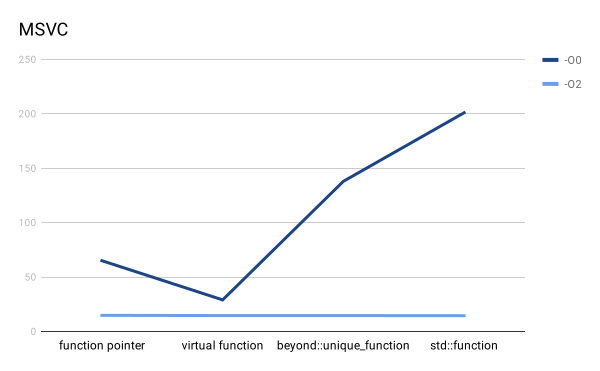
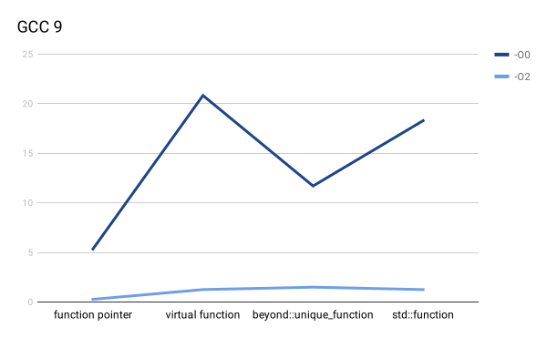
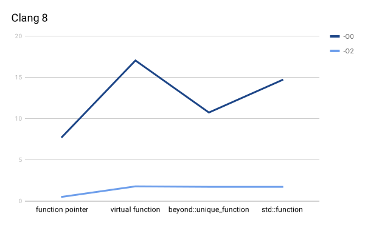

# beyond::unique_function

This repository is a C++17 implementation of [unique_function](http://www.open-std.org/jtc1/sc22/wg21/docs/papers/2019/p0228r3.html).

[](https://travis-ci.org/LesleyLai/unique_function)
[](https://ci.appveyor.com/project/LesleyLai/unique-function/branch/master)
[](https://codecov.io/gh/LesleyLai/unique_function)

`unique_function` is a proposed standard library type-erased function type that improves `std::function`. The interface of `unique_function` is almost identical to `std::function`, with the following exceptions:

### Move only
`unique_function` does not provides copy operations. This sounds like a restriction, but it means `unique_function` can support move-only function objects.

### Const-correctness
The `operator()` of `std::function` is `const` qualified even when the passed in a mutable function object. For example,

```cpp
const std::function<int()> f {[x=0]() mutable { return ++x; }};
f(); // fine, returns 1
f(); // returns 2
```


`unique_function` does not suffer this const correctness problem `std::function`. In `unique_function<F>`, the `operator()` is `const` qualified only if the function type `F` is const qualified. For example,

```cpp
beyond::unique_function<int()> f1 {[x=0]() mutable { return ++x; }};
beyond::unique_function<int() const> f2 {[x=0]() mutable { return ++x; }};  // TODO: Should not compile, no problem currently
beyond::unique_function<int() const> f3 {[x=0]() { return x; }};
const beyond::unique_function<int()> f4 {[x=0]() mutable { return ++x; }};
const beyond::unique_function<int() const> f5 {[x=0]() { return x; }};
f1(); // OK
f3(); // OK
f4(); // Will not compile
f5(); // OK
```

### Removal of `target` and `target_type`
Not many people are using RTTI for `std::function` anyway.

## Memory Footprint under a 64 bits machine
- Total size: 48 bits
- Behavior pointer: 8 bits (Function pointer to polymorphic behaviors except invocation)
- Function pointer: 8 bits (Function pointer to invocation)
- Storage: 32 bits


## Customization
### Build Option
`beyond::unique_function` is a header-only library, but the following CMake build options are used to enable test or benchmark during development
- `BEYOND_UNIQUE_FUNCTION_BUILD_TESTS` Build unit tests and benchmarks
- `BEYOND_UNIQUE_FUNCTION_BUILD_TESTS_COVERAGE` Build test with coverage, must enable `BEYOND_UNIQUE_FUNCTION_BUILD_TESTS` first

### Macros
You can either define macros before every include or use the CMake build system setting with the same name.
- `BEYOND_UNIQUE_FUNCTION_NAMESPACE`: defines the namespace of the library, it is `beyond` by default
- `BEYOND_UNIQUE_FUNCTION_NO_EXCEPTION`: if defined, then the implementation of `operator()` will not throw and invoking a `unique_function` with no underlying target will result in undefined behavior. Note this will not prevent the underlying function from throwing.

## benchmark
Below is a benchmark on invocation overhead. It is not rigorous, but it does showes that the overhead of `beyond::unique_function` is similar to `std::function`.

Windows 10, Intel Core i7-8650U CPU @ 1.90GHz (8 CPUs), ~2.1GHz, MSVC 2019


Arch Linux, Intel(R) Core(TM) i7-7700 CPU @ 3.60GHz



## Compiler support

Tested on:
- Windows
  * MSVC 2019
- Linux
  * g++-9
  * g++-8
  * clang-9
  * clang-8
  * clang-7
  * clang-6.0

----------

[]("http://creativecommons.org/publicdomain/zero/1.0/")

To the extent possible under law, [Lesley Lai](http://lesleylai.info/) has waived all copyright and related or neighboring rights to the `beyond::unique_function` library.
